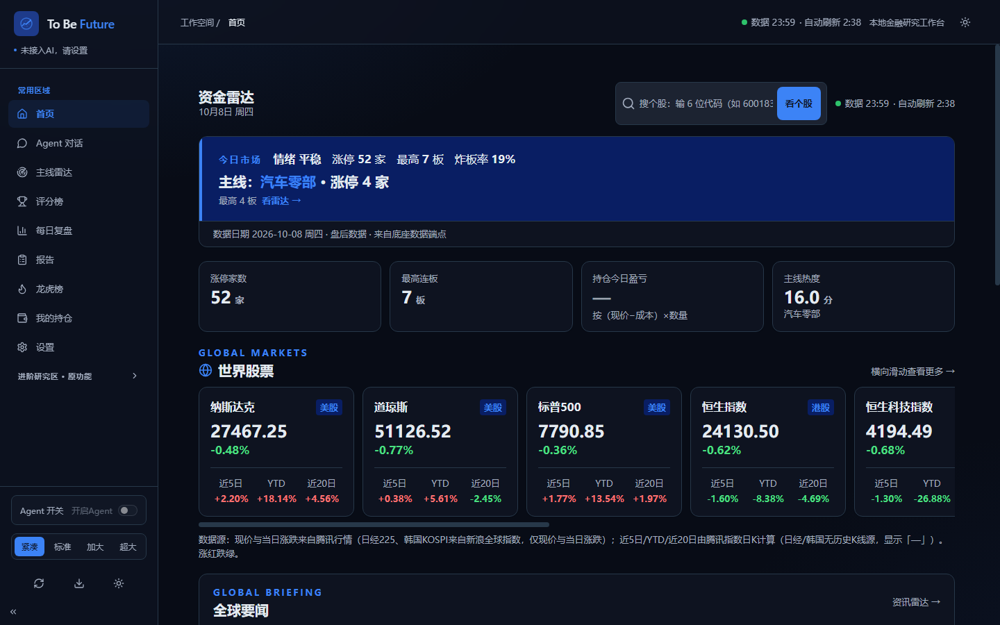
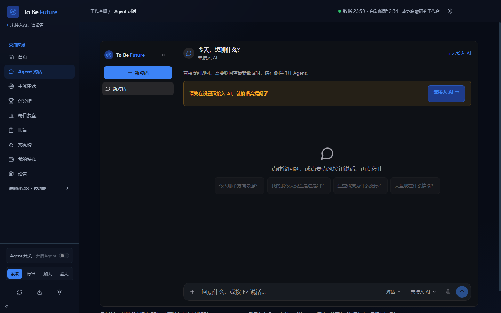
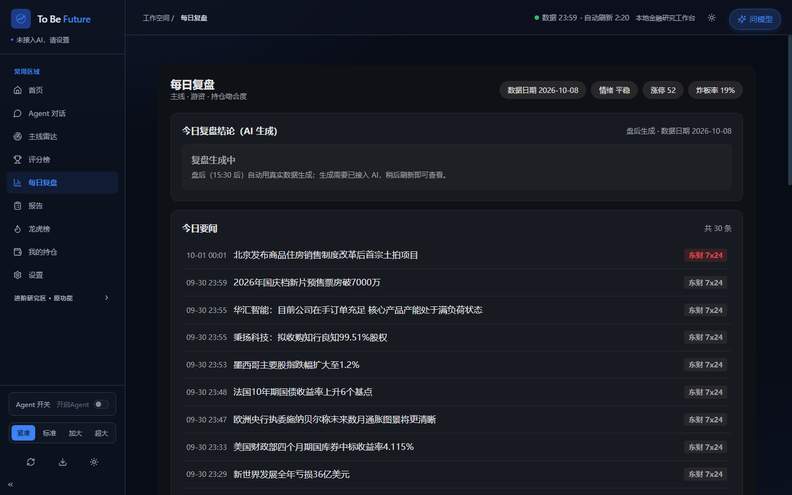

<h1 align="center">To Be Future 资金雷达工作台</h1>

<p align="center">
  <b>跟资金动向的个人投研工作台 · 给不盯盘的家人用</b><br>
  评分榜 · 龙虎榜 · 每日复盘 · 持仓 · 个股报告 · 对话 Agent
</p>

<p align="center">
  <a href="LICENSE"></a>
  
  
  
</p>

To Be Future 资金雷达工作台是一款面向 A 股的"跟资金动向型"个人投研工作台，把评分榜、板块要闻、世界股票指数、龙虎榜、每日复盘、持仓管理和个股报告汇集在一起，配合一个能对话、能按 Plan / Goal 模式工作的 Agent，用大字界面把"钱今天在往哪里走"讲清楚。适合给不盯盘、不熟悉复杂软件的家人日常使用。

---

## 免责声明

**本项目仅供学习交流使用，不作商业用途；行情与财务数据均来自公开渠道，可能有延迟或缺失，不构成任何投资建议。**

---

## 本项目与 Vibe-Research 的关系

本项目基于开源项目 **Vibe-Research**（MIT 许可）二次改造，保留原 MIT 许可与原作者信息。

- 原项目 GitHub：https://github.com/simonlin1212/Vibe-Research
- 原项目官网：https://viberesearch.wiki （技术边界，保留不改）

在 Vibe-Research 通用投研工作台的底座之上，本项目针对"跟资金动向"这一场景做了如下二次改造：

| 方面 | 原 Vibe-Research | 本项目 To Be Future 资金雷达 |
|---|---|---|
| 品牌 | Vibe Research | To Be Future（资金雷达工作台） |
| 核心模块 | 通用投研栏目（资讯 / 行业 / 个股研究 / 回测等） | 新增资金雷达模块：评分榜 / 板块要闻 / 世界股票 / 龙虎榜 / 持仓 / 复盘 / 报告 |
| 对话 Agent | 普通对话 + 按需开启 Agent | 增强：Plan / Goal 模式、Agent 操作模块、多模型切换、本地流式语音 |
| 界面 | 原主题 | DSH 蓝主题 + 四档字号 + 红涨绿跌（A 股口径） |
| 交付形态 | 源码 + 浏览器 UI | 增加 Electron 双平台打包（Windows NSIS 安装版 + Mac arm64 待打包） |

原项目的进阶研究区（资讯雷达、产业信号、板块中心、个股研究、多空辩论、回测、自选股、我的研报、研究记录、技能中心）在本项目中保留可用，内容未改动。

---

## 功能清单

### 常用区域（大字 UI，日常使用）

| 模块 | 干什么 |
|---|---|
| 首页 | 涨停家数 / 最高连板 / 持仓盈亏 / 主线热度一屏看全，附世界股票指数卡与板块要闻入口 |
| 评分榜 | 全市场个股按综合评分排序，点击可直接下钻到个股报告 |
| 主线雷达 | 主线板块热度榜、涨停梯队、炸板池，标注"是否覆盖我的持仓" |
| 每日复盘 | 晨报（AI 生成 + 语音朗读）、主线复盘结论、次日关注清单、游资动向摘要、持仓吻合度 |
| 龙虎榜 | 上榜记录 + 席位明细，内置 52 个游资席位标签（游资 / 机构 / 量化），净买额红涨绿跌 |
| 个股报告 | 综合评分（0-100）、四大类指标卡、风险点、多空倾向；历史报告可增删、导出（Markdown / PDF）、锁定 |
| 我的持仓 | 录入成本与数量，按现价计算今日 / 累计盈亏；不提供下单交易 |
| 设置 | 四档字号、深浅色、持仓管理、关注板块、晨报与免打扰 |
| Agent 对话 | 对话 / Plan / Goal 三种模式，多模型切换，本地流式语音输入与朗读 |

### 进阶研究区（沿用底座原功能）

资讯雷达、产业信号、板块中心、个股研究、多空辩论、回测、自选股、我的研报、研究记录、技能中心，沿用 Vibe-Research 原页面。

---

## 界面预览

以下截图来自 v1.2.0（深色主题、1440 × 900、连接真实行情数据；Agent 对话页为未接入 AI 的真实首开状态）：

| 首页 | Agent 对话 | 每日复盘 |
|---|---|---|
|  |  |  |

截图说明见 [assets/screenshots/2026-10-07/README.md](assets/screenshots/2026-10-07/README.md)。

---

## 安装使用

下载页（GitHub Releases，含最新版本与全部安装包）：<https://github.com/LINKGO123/To-Be-Future/releases/latest>

### Windows

下载 `fund-radar-desktop-setup-1.2.0.exe`，双击后按向导安装：

- 可自选安装目录（例如 D 盘），免管理员权限
- 安装完成后自动在桌面与开始菜单创建"To Be Future 资金雷达"快捷方式
- 双击快捷方式即可打开，无需每次解压

### Mac

下载 `fund-radar-desktop-1.2.0.dmg`（Apple Silicon），打开后把「To Be Future 资金雷达」拖进「应用程序」：

- 首次打开需**右键 → 打开**（未签名，Gatekeeper 提示属正常，只需一次）

详细安装、卸载说明见 [release/下载说明.md](release/下载说明.md)。

---

## 接入 AI（DeepSeek Key）

本工作台的对话、晨报、复盘结论等 AI 能力需要接入自己的模型 Key：

1. 打开"设置"，进入 AI 接入
2. 选择 DeepSeek，填写 API Key（以及服务地址与模型名）
3. 点击"测试并保存"，测试成功后才生效

**Key 只存本机**：Key 保存在当前电脑浏览器的本机 `localStorage`，仅在调用时经本机后端转发给所选模型服务商，不进入仓库、后端配置、运行账本或日志。共享电脑用完请主动清除。

多模型切换：接入多个来源后，可在 Agent 对话页下拉切换，切换不打断当前对话。

---

## 开发（本地跑）

### 技术栈

| 层 | 技术 |
|---|---|
| 前端 | React + Vite |
| 后端 | Node / TypeScript（orchestrator 编排器） |
| 数据层 | Python |
| 桌面壳 | Electron（Windows NSIS 安装版 + Mac arm64 待打包） |
| 本地语音 | sherpa-onnx 离线语音识别（免联网、免密钥） |

### 环境要求

| 项目 | 要求 |
|---|---|
| 操作系统 | Windows 11 / macOS / Linux |
| Node.js | ≥ 22.18，推荐 24 LTS（需启用 TypeScript 支持的官方构建） |
| Python | ≥ 3.11，推荐 3.12 |

### 从源码运行

```bat
git clone https://github.com/simonlin1212/Vibe-Research.git vibe-research-agent
cd vibe-research-agent
scripts\setup-windows.cmd
scripts\start.cmd
```

macOS / Linux 使用 `scripts/setup` 与 `scripts/start`。启动后浏览器打开 `http://127.0.0.1:5930`。

桌面壳打包（Windows NSIS 安装版）：

```bat
npm run electron:build
```

打包产物输出到 `release/` 目录。

---

## 许可证

本仓库采用 [MIT License](LICENSE)，保留原 Vibe-Research（原作者 simonlin1212）的 MIT 许可与原作者信息。

原项目链接：https://github.com/simonlin1212/Vibe-Research
